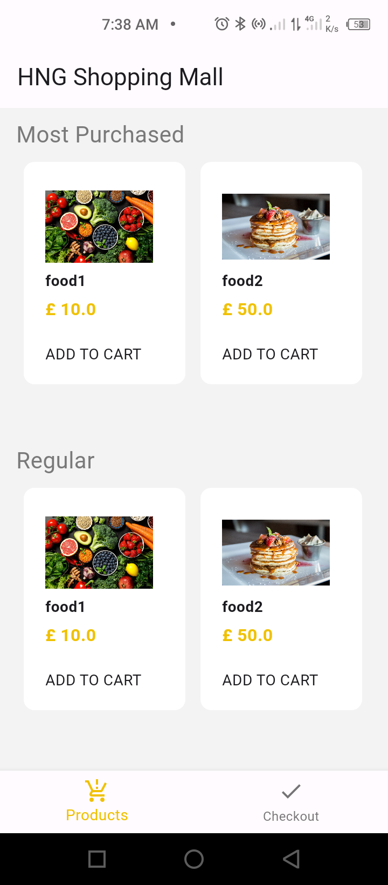
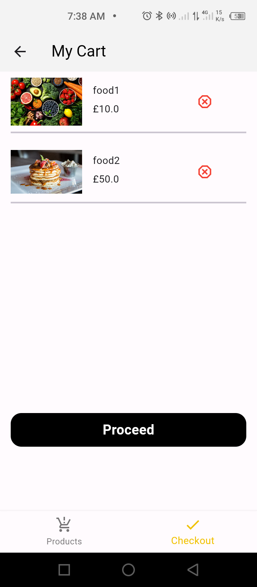

# hng_project

A simple application that demonstrates list of product and how to add unique product to a checkout.

## Features
- Have the functionality of adding and removing items to the Checkout 
- A button that navigates to an Order Successful screen from the Checkout screen.
- Prevents duplicate items from being added

## Screenshots





## Apk Download
- [Download link](https://drive.google.com/file/d/1WF2pGouhJrzqiXJiw4b6NN4Zg586ydyC/view?usp=sharing)

### Prerequisites

You need to have the following software installed on your machine:

- [Dart SDK](https://dart.dev/get-dart)
- [Flutter SDK](https://flutter.dev/docs/get-started/install) (if using Flutter)

### Installing

1. Clone the repository:

```bash
git clone https://github.com/Aradhik11/hng_shopping.git
cd hng_shopping.git


